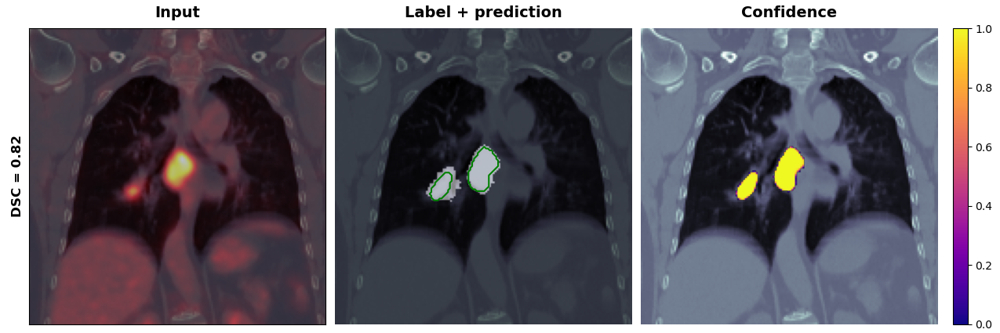

# Multi-modal PET-CT Deep Learning Analysis for Advanced NSCLC ITV Segmentation

> **Master's Thesis** | Jeremi Olejnik | University of Groningen | July 2025

## Overview

This repository contains the implementation of a deep learning framework for automated Internal Target Volume (ITV) segmentation in advanced Non-Small Cell Lung Cancer (NSCLC) patients using multi-modal PET-CT imaging.

**Key Innovation:** Demonstrates that incorporating PET functional imaging into CT-based deep learning models significantly improves automated segmentation of combined primary tumors and pathological lymph nodes in motion-inclusive thoracic volumes.

## Methodology

- **Dataset:** 689 advanced NSCLC patients (549 training, 140 test)
- **Registration:** Mask-guided rigid registration (ITK-Elastix) between planning CT and low-dose CT, with PET co-registration
- **Architectures:**  Skip scSE-LSTM-3DUnet and SwinUNETR vision transformer (MONAI)
- **Training:** 5-fold cross-validation with combined BCE + Dice loss
- **Target:** Motion-inclusive ITVs from 4DCT (not static GTVs) including pathological lymph nodes

## Key Results
### Image registration
| Model | SSIM | DSC | HD95 | TRE_L | TRE_R |
|:-:|:-:|:-:|:-:|:-:|:-:|
| Mirada Medical |
| n = 30 | 0.34 ± 0.06 | 0.91 ± 0.03 | 3.82 ± 1.47 | 3.45 ± 2.50 | 3.24 ± 2.37
| ITK-Elastix |
| n = 30 | 0.44 ± 0.06 | 0.94 ± 0.02 | 2.88 ± 1.31 | 1.68 ± 1.25 | 0.94 ± 0.62
| n = 689 | 0.45 ± 0.10 | 0.93 ± 0.09 | 3.70 ± 1.50 | 1.92 ± 1.35 | 1.38 ± 0.73  
###

### Model training
|| Model | DSC | SurfDSC | HD95 (mm) | Precision | Recall |
|:-:|:-:|:-:|:-:|:-:|:-:|:-:|
| **Validation**|
|| CT-only | 0.52 ± 0.03 | 0.50 ± 0.03 | 45.72 | 0.67 ± 0.03 | 0.55 ± 0.04 |
|| **PET-CT** | **0.65 ± 0.01** | **0.63 ± 0.01** | **26.33** | **0.74 ± 0.03** | **0.66 ± 0.03** |    
| **Test**|
|| CT-only | 0.34 ± 0.05 | 0.29 ± 0.04 | 88.08 | 0.32 ± 0.05 | 0.45 ± 0.06 |
|| **PET-CT** | **0.64 ± 0.01** | **0.60 ± 0.01** | **23.07** | **0.69 ± 0.01** | **0.66 ± 0.02** |  
###

### Achievements

✅ **Stable generalization** across validation and test sets  
✅ **88% improvement in DSC** with PET incorporation (0.64 vs 0.34)  
✅ **74% reduction in boundary errors** (HD95: 23.07 mm vs 88.08 mm)  
✅ **Particular benefit** in small volumes and anatomically complex cases

## Full Thesis

**Read the complete thesis:** [University of Groningen Repository](https://fse.studenttheses.ub.rug.nl/36532/1/mBME2025OlejnikJ.pdf)  

## Packages used
Torch 2.5.1  
MONAI 1.3.0  
Optuna 4.2.1  
scikit-image 0.25.0